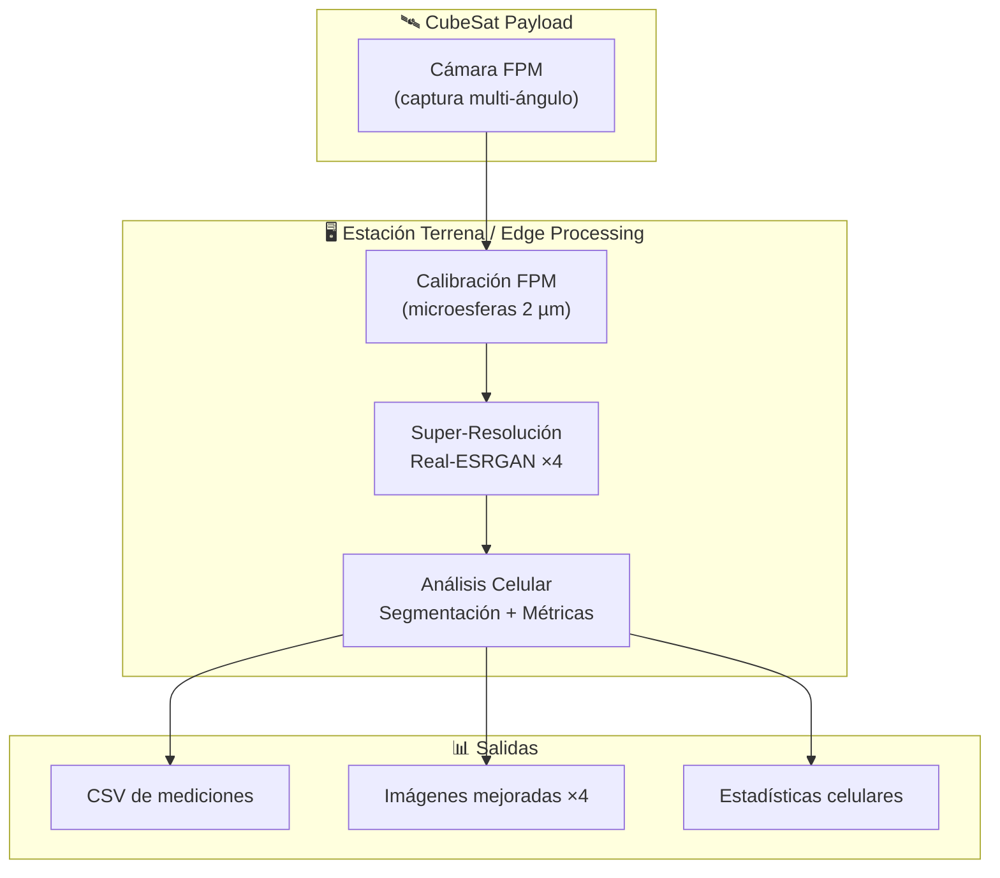

# CubeSat EdgeAI Payload

Pipeline de procesamiento de imágenes embebido para CubeSat con microscopía FPM (Fourier Ptychographic Microscopy), super-resolución por IA y análisis celular automatizado.

---

## Pipeline General del Sistema



---

## Pipeline de Imagen Detallado

```mermaid
flowchart LR
    subgraph INPUT["1 · Captura"]
        RAW["Imagen RAW\nFPM / TIFF"]
    end

    subgraph CALIBRATE["2 · Calibración"]
        direction TB
        LOAD["Cargar imagen"]
        SPHERE["Detectar microesferas\n(⌀ 2 µm conocido)"]
        SCALE["Calcular µm/pixel"]
        LOAD --> SPHERE --> SCALE
    end

    subgraph ENHANCE["3 · Super-Resolución"]
        direction TB
        RRDB["RRDBNet\n(64 filtros, 23 bloques)"]
        X4["Upscale ×4\nGPU / CPU"]
        RRDB --> X4
    end

    subgraph ANALYZE["4 · Análisis"]
        direction TB
        VIG["Remover viñeteo"]
        THRESH["Umbral adaptativo\n(Canny + morfología)"]
        SEG["Segmentación\n(skimage.measure)"]
        METRIC["Métricas por célula\n(área, perímetro, circularidad)"]
        VIG --> THRESH --> SEG --> METRIC
    end

    RAW --> LOAD
    SCALE --> RRDB
    X4 --> VIG
    METRIC --> RESULTS["CSV + Gráficos"]
```



---

## Estructura del Proyecto

```
CubeSat-EdgeAI-Payload/
├── fpm_calibration_tool.py      # GUI de calibración y medición FPM
├── analisis_calibracion.py      # Análisis de resultados de calibración
├── analisis_multiple_calibraciones.py
├── cell_analyzer_gui.py         # GUI de análisis celular
├── analyze_cells.py             # Pipeline de segmentación celular
├── escalar_x4.py                # Script simple de super-resolución
│
├── Minimal/                     # Inferencia mínima Real-ESRGAN
│   ├── inference_minimal.py     # Script standalone de upscale ×4
│   ├── rrdbnet.py               # Arquitectura RRDBNet
│   └── RealESRGAN_x4.pth       # Pesos del modelo
│
├── Real-ESRGAN/                 # Repositorio completo Real-ESRGAN
├── Modelo/                      # Pesos del modelo (copia)
│
├── Imagenes/                    # Imágenes de prueba y escaneos
├── Resultados/                  # Salidas procesadas
└── Documentos de Referencia/    # Papers y resumen ejecutivo
```

---

## Módulos Principales

### 1. Calibración FPM (`fpm_calibration_tool.py`)

Herramienta GUI interactiva (OpenCV + tkinter) para calibrar imágenes de microscopía usando microesferas de poliestireno de 2 µm como referencia.

**Controles:** `c` calibrar · `m` medir · `v` ROI zoom · `s` guardar · `q` salir

### 2. Super-Resolución (`Minimal/inference_minimal.py`)

Upscaling ×4 con Real-ESRGAN (RRDBNet: 64 filtros, 23 bloques residuales). Soporta GPU (CUDA) y CPU.

### 3. Análisis Celular (`cell_analyzer_gui.py`)

Segmentación automática de células con remoción de viñeteo, umbral adaptativo (Canny + morfología), y extracción de métricas (área, perímetro, circularidad).

---

## Requisitos

```bash
# Calibración y análisis
pip install -r requirements_calibration.txt

# Super-resolución (GPU recomendado)
pip install torch torchvision opencv-python numpy

```

---

## Uso Rápido

```bash
# Calibración FPM
python fpm_calibration_tool.py <imagen.tiff>

# Super-resolución ×4
python Minimal/inference_minimal.py

# Análisis celular
python cell_analyzer_gui.py
```
