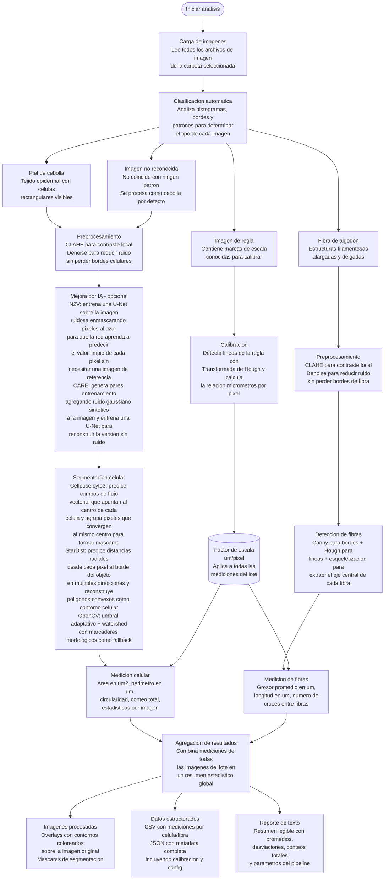

# CubeSat EdgeAI Payload

Pipeline autónomo de microscopía para CubeSat: calibración, mejora por IA, segmentación celular, detección de fibras y reporte — diseñado para correr en Raspberry Pi 5.

---

## Arquitectura del Pipeline



### Descripcion de cada etapa

**1. Carga y clasificacion.** El pipeline lee todas las imagenes de la carpeta de entrada y las clasifica automaticamente segun su contenido. Analiza histogramas de intensidad, densidad de bordes y patrones espaciales para distinguir entre imagenes de regla (para calibracion), piel de cebolla (tejido epidermal), fibra de algodon (estructuras filamentosas) e imagenes no reconocidas. Las imagenes no reconocidas se procesan como cebolla por defecto.

**2. Calibracion.** Si existe una imagen de regla en el lote, el pipeline detecta las marcas de escala usando la Transformada de Hough para lineas y calcula automaticamente cuantos micrometros equivale cada pixel. Este factor se aplica a todas las mediciones posteriores. Tambien se puede calibrar manualmente desde la GUI o usar un valor por defecto del archivo de configuracion.

**3. Preprocesamiento.** Cada imagen pasa por CLAHE (Contrast Limited Adaptive Histogram Equalization) para mejorar el contraste local sin saturar zonas brillantes, seguido de un filtro de denoising que reduce el ruido preservando los bordes de las estructuras biologicas.

**4. Mejora por IA (opcional).** Solo para imagenes de cebolla. Se puede activar desde la GUI o se omite. Noise2Void (N2V) es un metodo self-supervised que no necesita imagenes limpias de referencia: entrena una red U-Net (470K parametros) directamente sobre la imagen ruidosa. Durante el entrenamiento, enmascara pixeles al azar (blind-spot) y obliga a la red a predecir el valor de cada pixel enmascarado usando solo sus vecinos. Como el ruido es aleatorio e independiente por pixel, la red aprende a predecir la senal limpia sin haber visto nunca una version sin ruido. Genera 400 patches de 64x64 de la imagen y entrena 10-20 epochs. CARE (Content-Aware Restoration) usa la misma arquitectura U-Net pero con un enfoque noise2clean: toma la imagen original, genera copias con ruido gaussiano sintetico agregado (30% de intensidad) y entrena la red para reconstruir la version sin el ruido agregado. Ambos metodos producen una imagen con menos ruido que se pasa a la etapa de segmentacion.

**5. Segmentacion.** Para cebolla hay tres opciones. Cellpose cyto3 es una red neuronal entrenada en miles de imagenes de celulas de distintos tipos: predice dos campos de flujo vectorial (horizontal y vertical) donde cada vector apunta hacia el centro de la celula mas cercana, luego agrupa todos los pixeles cuyos flujos convergen al mismo punto para formar la mascara de cada celula individual. Esto le permite separar celulas que se tocan sin sobre-segmentar. StarDist predice desde cada pixel la distancia al borde del objeto mas cercano en 32 direcciones radiales, y con esas distancias reconstruye un poligono convexo que representa el contorno de cada celula. Es mas rapido que Cellpose (4s vs 38s en CPU) porque la inferencia es un solo paso sin iteracion de flujos. OpenCV usa umbral adaptativo para binarizar la imagen, operaciones morfologicas (apertura, cierre) para limpiar ruido, distance transform para encontrar marcadores y watershed para separar celulas tocandose. Si el modelo de IA seleccionado falla por cualquier razon (memoria, dependencia faltante, imagen incompatible), el pipeline cae automaticamente a OpenCV. Para fibras: se usa deteccion de bordes Canny, Transformada de Hough para detectar segmentos de linea y esqueletizacion morfologica para reducir cada fibra a su eje central de un pixel de ancho.

**6. Medicion.** Convierte las segmentaciones en mediciones fisicas usando el factor de calibracion. Para celulas: area (um2), perimetro (um), circularidad (0-1 donde 1 es circulo perfecto), conteo total. Para fibras: grosor promedio (um), longitud (um), numero de cruces entre fibras.

**7. Exportacion.** Genera tres tipos de salida: imagenes con overlays coloreados sobre la original y mascaras binarias; archivos CSV con una fila por celula/fibra y JSON con metadata completa; y un reporte de texto legible con estadisticas resumidas del lote completo.

---

## Modelos de IA Integrados

### Segmentación

| Modelo | Tipo | Tamaño | Tiempo (CPU) | Células detectadas* | Viable RPi 5 |
|---|---|---|---|---|---|
| **Cellpose v3 (cyto3)** | Deep Learning | ~25 MB | ~38s | 162 | Con ONNX |
| **StarDist 2D** | Deep Learning | ~30 MB | ~4s | ~150 | Si (más rápido) |
| **OpenCV** | Clásico | — | <1s | Variable | Si |

*\*Resultados en imagen de prueba 630×1200*

### Denoising / Mejora

| Modelo | Tipo | Entrenamiento | Tiempo (CPU) |
|---|---|---|---|
| **Noise2Void (N2V)** | Self-supervised | Entrena en la propia imagen (sin referencia limpia) | ~80s (10 epochs) |
| **CARE** | Noise2Clean | Entrena con ruido sintético añadido | ~80s (10 epochs) |

> **Nota RPi 5:** StarDist es 9× más rápido que Cellpose en CPU — candidato ideal para exportar a ONNX.

---

## Reconstrucción FPM

Módulo de Fourier Ptychographic Microscopy para setup lensless + OLED:

| Método | Descripción | Uso |
|---|---|---|
| `multiangle` | Fusión multi-ángulo (lensless + OLED) | Setup CubeSat |
| `multiframe` | Multi-frame con shifts sub-pixel | Microscopio con stage |
| `fourier` | Ptychography completa con lente | Microscopio convencional |

```bash
python main.py --fpm SCAN_FOLDER --fpm-method multiangle --fpm-upscale 2
```

---

## GUI (Interfaz con Tabs)

La GUI está organizada en 3 pestañas:

| Tab | Contenido |
|---|---|
| **Pipeline** | Carpeta entrada, vista previa, calibración, selección de mejora (N2V/CARE), selección de segmentación (Cellpose/StarDist/OpenCV), ejecución y progreso |
| **FPM** | Reconstrucción FPM: carpeta, método, upscale, iteraciones, alineación |
| **Modelos IA** | Prueba individual de modelos: selección de imagen, ejecución de Cellpose/StarDist/N2V/CARE, ejecución de todos |

Log compartido en la parte inferior de todas las pestañas.

---

## Estructura del Proyecto

```
PruebaRealSgan/
├── main.py                              # Entry point (GUI / CLI / FPM / Viewer)
├── config.yaml                          # Configuración del pipeline
├── requirements_pipeline.txt            # Dependencias
│
├── pipeline/                            # Módulos del pipeline autónomo
│   ├── __init__.py
│   ├── gui.py                           # GUI con tabs (Pipeline / FPM / Modelos IA)
│   ├── controller.py                    # Orquestador del pipeline completo
│   ├── config.py                        # Carga de configuración YAML
│   ├── classifier.py                    # Clasificación automática de imágenes
│   ├── calibration.py                   # Calibración automática (regla)
│   ├── manual_calibration.py            # Calibración manual (GUI)
│   ├── preprocess.py                    # CLAHE, denoise, preprocesamiento
│   ├── ai_enhance.py                    # Modelos IA: Cellpose, StarDist, N2V, CARE
│   ├── segmentation_onion.py            # Segmentación celular (OpenCV)
│   ├── segmentation_fiber.py            # Detección de fibras
│   ├── measurement.py                   # Mediciones dimensionales
│   ├── export.py                        # Exportación JSON/CSV/imágenes
│   ├── fpm_reconstruction.py            # Reconstrucción FPM multi-ángulo
│   └── viewer.py                        # Visor interactivo de resultados
│
├── fpm_calibration_tool.py              # GUI calibración FPM (standalone)
├── cell_analyzer_gui.py                 # GUI análisis celular (standalone)
├── analisis_calibracion.py              # Análisis de resultados de calibración
├── analisis_multiple_calibraciones.py   # Análisis multi-sesión
│
├── models/                              # Pesos de modelos descargados
├── Imagenes/                            # Imágenes de entrada
├── Resultados/                          # Salidas procesadas
├── Minimal/                             # Inferencia mínima Real-ESRGAN
├── Real-ESRGAN/                         # Repo completo Real-ESRGAN
├── Documentos de Referencia/            # Papers y datasheets
└── prompts/                             # Prompts de evaluación IA
```

---

## Uso Rápido

```bash
# Activar entorno virtual
venv310\Scripts\activate        # Windows
source venv310/bin/activate     # Linux

# Abrir GUI completa (modo por defecto)
python main.py

# Pipeline CLI (sin GUI)
python main.py --cli --folder ./Imagenes/mi_carpeta

# Reconstrucción FPM desde CLI
python main.py --fpm ./scan_folder --fpm-method multiangle --fpm-upscale 2

# Visor de resultados
python main.py --viewer --folder ./Resultados/run_20260416

# Calibración FPM standalone
python fpm_calibration_tool.py imagen.tiff
```

---

## Instalación

```bash
# Dependencias del pipeline
pip install -r requirements_pipeline.txt
```

### Dependencias principales

```
opencv-python>=4.8.0
numpy>=1.24.0,<2
scikit-image>=0.21.0
PyYAML>=6.0
cellpose>=3.0,<4          # v3 con cyto3 (v4 CPSAM demasiado pesado para CPU)
csbdeep>=0.7.2
stardist>=0.9.0
tensorflow>=2.11
torch>=2.0
```

> **Nota:** `numpy<2` es necesario por compatibilidad con torch. Cellpose se instala con `--no-deps` para evitar conflictos con opencv-python-headless.

---

## Pipeline de Evaluación de Modelos

Estrategia de 4 fases para seleccionar el mejor modelo de segmentación:

| Fase | Objetivo | Estado |
|---|---|---|
| **1. Baseline clásico** | Establecer rendimiento base con OpenCV | Completado |
| **2. Modelos preentrenados** | Evaluar Cellpose cyto3, StarDist, N2V, CARE | Completado |
| **3. Fine-tuning** | Especializar mejor modelo para piel de cebolla | Pendiente |
| **4. Edge Deploy** | Export ONNX + benchmark en RPi 5 | Pendiente |

### Resultados de Fase 2 (imagen de prueba 630×1200)

| Modelo | Células | Tiempo | Notas |
|---|---|---|---|
| Cellpose cyto3 | 162 | 38.1s | Diámetro auto: 77.7 px |
| StarDist 2D | ~150 | ~4s | 9× más rápido que Cellpose |
| N2V denoising | — | 80.9s | 470K params, 400 patches |

### Graceful Degradation

| Condición | Método | Latencia | Precisión |
|---|---|---|---|
| Normal (GPU/RPi) | Cellpose/StarDist (ONNX) | ~2-5s | Alta |
| Recursos limitados | OpenCV watershed + morfología | ~0.5s | Media |
| Modo mínimo | Solo medición con escala calibrada | ~0.1s | Básica |

---

## Configuración (`config.yaml`)

Secciones principales:

| Sección | Contenido |
|---|---|
| `mode` | Modo de operación (onion/fiber/auto) |
| `paths` | Carpetas de entrada/salida |
| `calibration` | Default µm/pixel, parámetros de detección de regla |
| `preprocess` | CLAHE clip limit, denoise strength |
| `onion` | Método de segmentación, parámetros de watershed |
| `fiber` | Detección Canny, Hough, skeleton |
| `ai_enhance` | Config de Cellpose, StarDist, N2V, CARE |

---

## Datasets de Referencia

| Dataset | Utilidad | Link |
|---|---|---|
| BBBC (Broad Bioimage Benchmark) | Benchmark de segmentación celular | broad.io/bbbc |
| Cellpose training data | Dataset base de cyto3 | cellpose.org |
| Data Science Bowl 2018 | Segmentación de núcleos | kaggle.com/c/data-science-bowl-2018 |
| Imágenes propias de cebolla | Fine-tuning especializado | Este repositorio |
