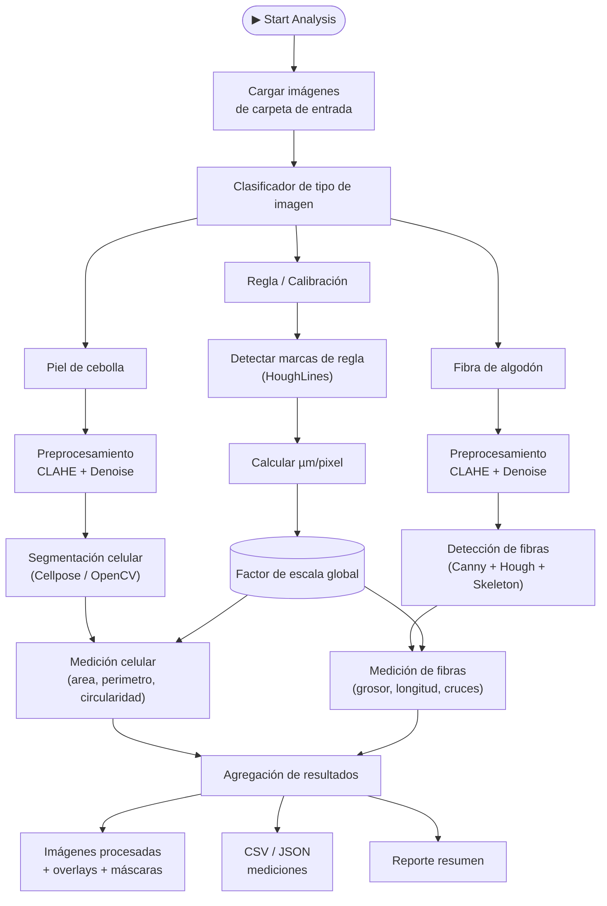
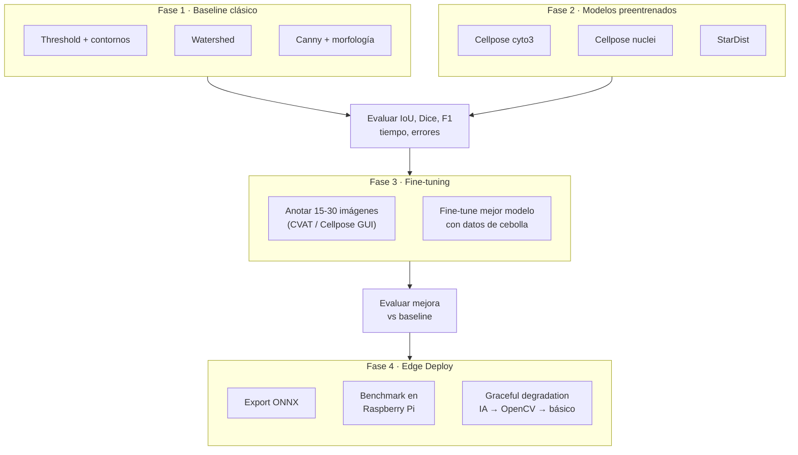

# CubeSat EdgeAI Payload

Pipeline autónomo de microscopía para CubeSat: un botón dispara captura, calibración, mejora por IA, segmentación celular y reporte — diseñado para correr en Raspberry Pi.

---

## Arquitectura del Sistema Autónomo



---

## Pipeline de Imagen Detallado

```mermaid
flowchart LR
    subgraph INPUT["1 · Captura"]
        RAW["Imagen RAW\nFPM / TIFF"]
    end

    subgraph CALIBRATE["2 · Calibración"]
        direction TB
        LOAD["Cargar imagen"]
        SPHERE["Detectar microesferas\n(⌀ 2 µm conocido)"]
        SCALE["Calcular µm/pixel"]
        LOAD --> SPHERE --> SCALE
    end

    subgraph ENHANCE["3 · Mejora"]
        direction TB
        CLAHE["CLAHE\n(contraste local)"]
        DENOISE["Denoise\n(preservar bordes)"]
        SHARP["Sharpening\n(opcional)"]
        CLAHE --> DENOISE --> SHARP
    end

    subgraph ANALYZE["4 · Análisis"]
        direction TB
        VIG["Remover viñeteo"]
        SEG["Segmentación\n(Cellpose / watershed)"]
        METRIC["Métricas por célula\n(área, perímetro, circularidad)"]
        VIG --> SEG --> METRIC
    end

    RAW --> LOAD
    SCALE --> CLAHE
    SHARP --> VIG
    METRIC --> RESULTS["CSV + Overlays + Reporte"]
```



---

## Pipeline de Evaluación de Modelos IA

Estrategia para seleccionar el mejor modelo de segmentación celular (piel de cebolla) antes de entrenar uno propio.



### Tabla comparativa de enfoques

| Modelo | Tipo | Requiere dataset propio | Fortaleza | Debilidad | Viable en RPi |
|---|---|---|---|---|---|
| OpenCV threshold | Clásico | No | Rápido, simple | Falla con bordes tenues | Si |
| Watershed | Clásico | No | Separa células tocándose | Sobre-segmenta | Si |
| Cellpose cyto3 | IA preentrenado | No (solo evaluar) | Generalista, robusto | Pesado para edge | Con ONNX |
| Cellpose nuclei | IA preentrenado | No | Bueno para núcleos | No detecta bordes celulares | Con ONNX |
| Fine-tuned propio | IA transfer | Si (15-30 imgs) | Optimizado para cebolla | Requiere anotación | Con ONNX |

### Métricas de evaluación

| Métrica | Qué mide | Umbral aceptable |
|---|---|---|
| IoU (Intersection over Union) | Overlap máscara predicha vs real | > 0.70 |
| Dice score | Similitud entre segmentaciones | > 0.80 |
| F1 score | Balance precisión-recall por célula | > 0.75 |
| Error de conteo | Células detectadas vs reales | < 10% |
| Error de área media | Desviación del área real | < 15% |
| Tiempo por imagen | Latencia de inferencia | < 5s en RPi |
| Uso de RAM | Memoria durante inferencia | < 1 GB en RPi |

### Características visuales clave para piel de cebolla

| Rasgo visual | Importancia | Cómo detectar si influye |
|---|---|---|
| Continuidad del borde celular | CRITICA | Bordes rotos → células fusionadas en la máscara |
| Contraste pared vs fondo | ALTA | Reducir contraste artificialmente y medir caída de IoU |
| Grosor aparente del borde | MEDIA | Comparar imágenes con bordes finos vs gruesos |
| Regularidad geométrica | MEDIA | Modelos clásicos funcionan mejor con formas regulares |
| Separación entre células contiguas | ALTA | Evaluar sobre-segmentación en zonas de contacto |
| Sensibilidad a iluminación desigual | ALTA | Probar con/sin CLAHE y comparar resultados |

---

## Plan de Implementación en 4 Fases

### Fase 1 — Baseline clásico

| | Detalle |
|---|---|
| **Objetivo** | Establecer rendimiento base sin IA |
| **Entradas** | 10+ imágenes de piel de cebolla + máscaras manuales |
| **Herramientas** | OpenCV (threshold, Canny, watershed, morfología) |
| **Salida** | Tabla de IoU/Dice/F1 por método clásico |
| **Criterio de avance** | Baseline medido; identificados los casos donde falla |

### Fase 2 — Evaluación con modelos preentrenados

| | Detalle |
|---|---|
| **Objetivo** | Comparar modelos IA sin entrenar nada |
| **Entradas** | Mismas imágenes + Cellpose cyto3, nuclei |
| **Herramientas** | Cellpose CLI, scikit-image (métricas) |
| **Salida** | Tabla comparativa completa (IA vs clásico) |
| **Criterio de avance** | Si IoU > 0.70 con algún modelo → Fase 3. Si no → revisar preprocesamiento |

### Fase 3 — Fine-tuning con imágenes propias

| | Detalle |
|---|---|
| **Objetivo** | Especializar el mejor modelo para piel de cebolla |
| **Entradas** | 15-30 imágenes anotadas (CVAT o Cellpose GUI) |
| **Herramientas** | Cellpose train CLI, PyTorch |
| **Salida** | Modelo fine-tuned + comparación de mejora vs Fase 2 |
| **Criterio de avance** | Mejora > 5% en IoU sobre el modelo base |

### Fase 4 — Exportación y deploy en Raspberry Pi

| | Detalle |
|---|---|
| **Objetivo** | Modelo corriendo en edge con latencia aceptable |
| **Entradas** | Modelo fine-tuned de Fase 3 |
| **Herramientas** | ONNX Runtime / NCNN, benchmarking |
| **Salida** | Modelo ONNX + métricas de latencia/RAM en RPi |
| **Criterio de avance** | Inferencia < 5s, RAM < 1 GB, IoU degradación < 5% |

### Graceful Degradation (sistema adaptativo)

| Condición | Método | Latencia | Precisión |
|---|---|---|---|
| Normal (GPU/RPi potente) | Cellpose fine-tuned (ONNX) | ~2-5s | Alta |
| Recursos limitados | OpenCV watershed + morfología | ~0.5s | Media |
| Modo mínimo | Solo medición con escala calibrada | ~0.1s | Básica |

---

## Estructura del Proyecto

```
CubeSat-EdgeAI-Payload/
├── fpm_calibration_tool.py          # GUI calibración y medición FPM
├── analisis_calibracion.py          # Análisis de resultados
├── analisis_multiple_calibraciones.py
├── cell_analyzer_gui.py             # GUI análisis celular
├── analyze_cells.py                 # Pipeline de segmentación
├── escalar_x4.py                    # Script de super-resolución
│
├── Minimal/                         # Inferencia mínima Real-ESRGAN
│   ├── inference_minimal.py
│   ├── rrdbnet.py
│   └── RealESRGAN_x4.pth
│
├── Real-ESRGAN/                     # Repo completo Real-ESRGAN
├── Modelo/                          # Pesos del modelo
│
├── Imagenes/                        # Imágenes de prueba y escaneos
├── Resultados/                      # Salidas procesadas
├── Documentos de Referencia/        # Papers y resumen ejecutivo
│
├── prompts/                         # Prompts de evaluación con IA
│   └── eval_modelos_segmentacion.md
│
└── dataset/                         # (futuro) Dataset de entrenamiento
    ├── onion/raw/
    ├── onion/annotated/
    ├── external/
    └── ruler/
```

---

## Módulos Principales

### 1. Calibración FPM (`fpm_calibration_tool.py`)

GUI interactiva (OpenCV + tkinter) para calibrar imágenes de microscopía usando microesferas de poliestireno de 2 µm como referencia.

**Controles:** `c` calibrar · `m` medir · `v` ROI zoom · `s` guardar · `q` salir

### 2. Super-Resolución (`Minimal/inference_minimal.py`)

Upscaling x4 con Real-ESRGAN (RRDBNet: 64 filtros, 23 bloques residuales). GPU (CUDA) y CPU.

### 3. Análisis Celular (`cell_analyzer_gui.py`)

Segmentación automática: remoción de viñeteo, umbral adaptativo (Canny + morfología), métricas (área, perímetro, circularidad).

---

## Requisitos

```bash
# Calibración y análisis
pip install -r requirements_calibration.txt

# Super-resolución (GPU recomendado)
pip install torch torchvision opencv-python numpy

# Evaluación de modelos (Fase 2+)
pip install cellpose scikit-image pandas matplotlib
```

---

## Uso Rápido

```bash
# Calibración FPM
python fpm_calibration_tool.py <imagen.tiff>

# Super-resolución x4
python Minimal/inference_minimal.py

# Análisis celular
python cell_analyzer_gui.py
```

---

## Datasets de Referencia

| Dataset | Utilidad | Link |
|---|---|---|
| BBBC (Broad Bioimage Benchmark) | Benchmark estándar de segmentación celular | broad.io/bbbc |
| Cellpose training data | Dataset base de cyto3 y nuclei | cellpose.org |
| Data Science Bowl 2018 | Segmentación de núcleos variados | kaggle.com/c/data-science-bowl-2018 |
| Imágenes propias de cebolla | Fine-tuning especializado | Este repositorio |
