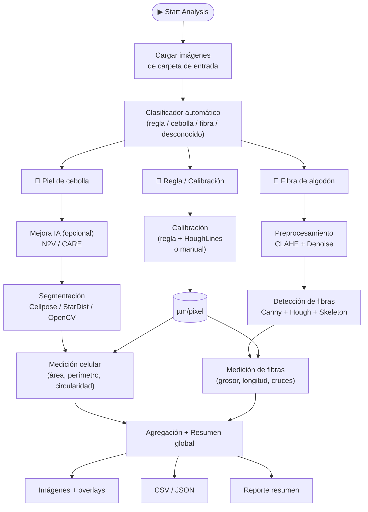

# CubeSat EdgeAI Payload

Pipeline autónomo de microscopía para CubeSat: calibración, mejora por IA, segmentación celular, detección de fibras y reporte — diseñado para correr en Raspberry Pi 5.

---

## Arquitectura del Pipeline



### Flujo detallado

| Etapa | Descripción | Métodos disponibles |
|---|---|---|
| **1. Calibración** | Establece la escala µm/pixel | Regla (HoughLines), manual (GUI), default |
| **2. Mejora de imagen** | Denoising / restauración (opcional) | Noise2Void (self-supervised), CARE (noise2clean), ninguno |
| **3. Segmentación** | Detección de células o fibras | Cellpose cyto3, StarDist 2D, OpenCV (watershed + morfología) |
| **4. Medición** | Métricas dimensionales calibradas | Área, perímetro, circularidad (células); grosor, longitud (fibras) |
| **5. Exportación** | Resultados estructurados | JSON, CSV, imágenes con overlay, reporte TXT |

Todas las etapas IA tienen **graceful degradation**: si un modelo falla, el pipeline continúa con OpenCV clásico.

---

## Modelos de IA Integrados

### Segmentación

| Modelo | Tipo | Tamaño | Tiempo (CPU) | Células detectadas* | Viable RPi 5 |
|---|---|---|---|---|---|
| **Cellpose v3 (cyto3)** | Deep Learning | ~25 MB | ~38s | 162 | Con ONNX |
| **StarDist 2D** | Deep Learning | ~30 MB | ~4s | ~150 | Si (más rápido) |
| **OpenCV** | Clásico | — | <1s | Variable | Si |

*\*Resultados en imagen de prueba 630×1200*

### Denoising / Mejora

| Modelo | Tipo | Entrenamiento | Tiempo (CPU) |
|---|---|---|---|
| **Noise2Void (N2V)** | Self-supervised | Entrena en la propia imagen (sin referencia limpia) | ~80s (10 epochs) |
| **CARE** | Noise2Clean | Entrena con ruido sintético añadido | ~80s (10 epochs) |

> **Nota RPi 5:** StarDist es 9× más rápido que Cellpose en CPU — candidato ideal para exportar a ONNX.

---

## Reconstrucción FPM

Módulo de Fourier Ptychographic Microscopy para setup lensless + OLED:

| Método | Descripción | Uso |
|---|---|---|
| `multiangle` | Fusión multi-ángulo (lensless + OLED) | Setup CubeSat |
| `multiframe` | Multi-frame con shifts sub-pixel | Microscopio con stage |
| `fourier` | Ptychography completa con lente | Microscopio convencional |

```bash
python main.py --fpm SCAN_FOLDER --fpm-method multiangle --fpm-upscale 2
```

---

## GUI (Interfaz con Tabs)

La GUI está organizada en 3 pestañas:

| Tab | Contenido |
|---|---|
| **Pipeline** | Carpeta entrada, vista previa, calibración, selección de mejora (N2V/CARE), selección de segmentación (Cellpose/StarDist/OpenCV), ejecución y progreso |
| **FPM** | Reconstrucción FPM: carpeta, método, upscale, iteraciones, alineación |
| **Modelos IA** | Prueba individual de modelos: selección de imagen, ejecución de Cellpose/StarDist/N2V/CARE, ejecución de todos |

Log compartido en la parte inferior de todas las pestañas.

---

## Estructura del Proyecto

```
PruebaRealSgan/
├── main.py                              # Entry point (GUI / CLI / FPM / Viewer)
├── config.yaml                          # Configuración del pipeline
├── requirements_pipeline.txt            # Dependencias
│
├── pipeline/                            # Módulos del pipeline autónomo
│   ├── __init__.py
│   ├── gui.py                           # GUI con tabs (Pipeline / FPM / Modelos IA)
│   ├── controller.py                    # Orquestador del pipeline completo
│   ├── config.py                        # Carga de configuración YAML
│   ├── classifier.py                    # Clasificación automática de imágenes
│   ├── calibration.py                   # Calibración automática (regla)
│   ├── manual_calibration.py            # Calibración manual (GUI)
│   ├── preprocess.py                    # CLAHE, denoise, preprocesamiento
│   ├── ai_enhance.py                    # Modelos IA: Cellpose, StarDist, N2V, CARE
│   ├── segmentation_onion.py            # Segmentación celular (OpenCV)
│   ├── segmentation_fiber.py            # Detección de fibras
│   ├── measurement.py                   # Mediciones dimensionales
│   ├── export.py                        # Exportación JSON/CSV/imágenes
│   ├── fpm_reconstruction.py            # Reconstrucción FPM multi-ángulo
│   └── viewer.py                        # Visor interactivo de resultados
│
├── fpm_calibration_tool.py              # GUI calibración FPM (standalone)
├── cell_analyzer_gui.py                 # GUI análisis celular (standalone)
├── analisis_calibracion.py              # Análisis de resultados de calibración
├── analisis_multiple_calibraciones.py   # Análisis multi-sesión
│
├── models/                              # Pesos de modelos descargados
├── Imagenes/                            # Imágenes de entrada
├── Resultados/                          # Salidas procesadas
├── Minimal/                             # Inferencia mínima Real-ESRGAN
├── Real-ESRGAN/                         # Repo completo Real-ESRGAN
├── Documentos de Referencia/            # Papers y datasheets
└── prompts/                             # Prompts de evaluación IA
```

---

## Uso Rápido

```bash
# Activar entorno virtual
venv310\Scripts\activate        # Windows
source venv310/bin/activate     # Linux

# Abrir GUI completa (modo por defecto)
python main.py

# Pipeline CLI (sin GUI)
python main.py --cli --folder ./Imagenes/mi_carpeta

# Reconstrucción FPM desde CLI
python main.py --fpm ./scan_folder --fpm-method multiangle --fpm-upscale 2

# Visor de resultados
python main.py --viewer --folder ./Resultados/run_20260416

# Calibración FPM standalone
python fpm_calibration_tool.py imagen.tiff
```

---

## Instalación

```bash
# Dependencias del pipeline
pip install -r requirements_pipeline.txt
```

### Dependencias principales

```
opencv-python>=4.8.0
numpy>=1.24.0,<2
scikit-image>=0.21.0
PyYAML>=6.0
cellpose>=3.0,<4          # v3 con cyto3 (v4 CPSAM demasiado pesado para CPU)
csbdeep>=0.7.2
stardist>=0.9.0
tensorflow>=2.11
torch>=2.0
```

> **Nota:** `numpy<2` es necesario por compatibilidad con torch. Cellpose se instala con `--no-deps` para evitar conflictos con opencv-python-headless.

---

## Pipeline de Evaluación de Modelos

Estrategia de 4 fases para seleccionar el mejor modelo de segmentación:

| Fase | Objetivo | Estado |
|---|---|---|
| **1. Baseline clásico** | Establecer rendimiento base con OpenCV | Completado |
| **2. Modelos preentrenados** | Evaluar Cellpose cyto3, StarDist, N2V, CARE | Completado |
| **3. Fine-tuning** | Especializar mejor modelo para piel de cebolla | Pendiente |
| **4. Edge Deploy** | Export ONNX + benchmark en RPi 5 | Pendiente |

### Resultados de Fase 2 (imagen de prueba 630×1200)

| Modelo | Células | Tiempo | Notas |
|---|---|---|---|
| Cellpose cyto3 | 162 | 38.1s | Diámetro auto: 77.7 px |
| StarDist 2D | ~150 | ~4s | 9× más rápido que Cellpose |
| N2V denoising | — | 80.9s | 470K params, 400 patches |

### Graceful Degradation

| Condición | Método | Latencia | Precisión |
|---|---|---|---|
| Normal (GPU/RPi) | Cellpose/StarDist (ONNX) | ~2-5s | Alta |
| Recursos limitados | OpenCV watershed + morfología | ~0.5s | Media |
| Modo mínimo | Solo medición con escala calibrada | ~0.1s | Básica |

---

## Configuración (`config.yaml`)

Secciones principales:

| Sección | Contenido |
|---|---|
| `mode` | Modo de operación (onion/fiber/auto) |
| `paths` | Carpetas de entrada/salida |
| `calibration` | Default µm/pixel, parámetros de detección de regla |
| `preprocess` | CLAHE clip limit, denoise strength |
| `onion` | Método de segmentación, parámetros de watershed |
| `fiber` | Detección Canny, Hough, skeleton |
| `ai_enhance` | Config de Cellpose, StarDist, N2V, CARE |

---

## Datasets de Referencia

| Dataset | Utilidad | Link |
|---|---|---|
| BBBC (Broad Bioimage Benchmark) | Benchmark de segmentación celular | broad.io/bbbc |
| Cellpose training data | Dataset base de cyto3 | cellpose.org |
| Data Science Bowl 2018 | Segmentación de núcleos | kaggle.com/c/data-science-bowl-2018 |
| Imágenes propias de cebolla | Fine-tuning especializado | Este repositorio |
