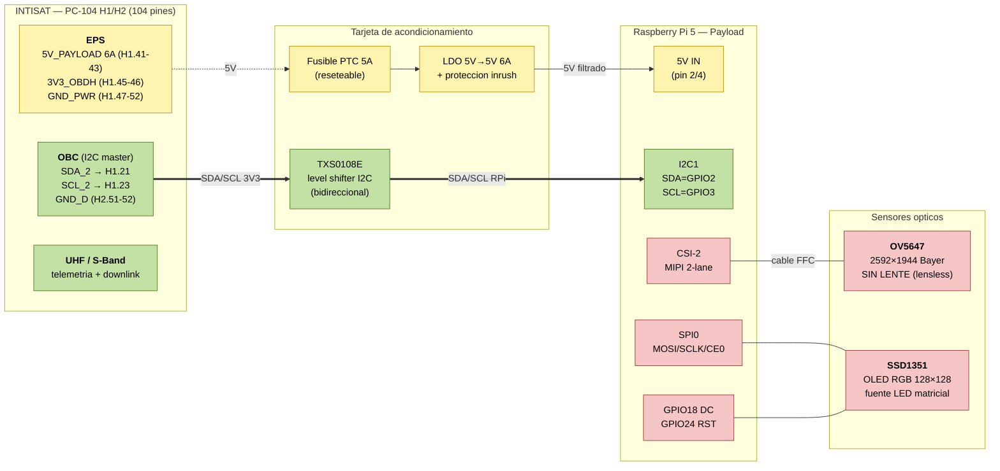
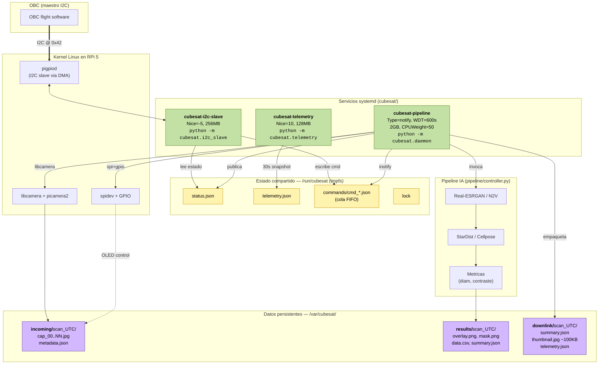
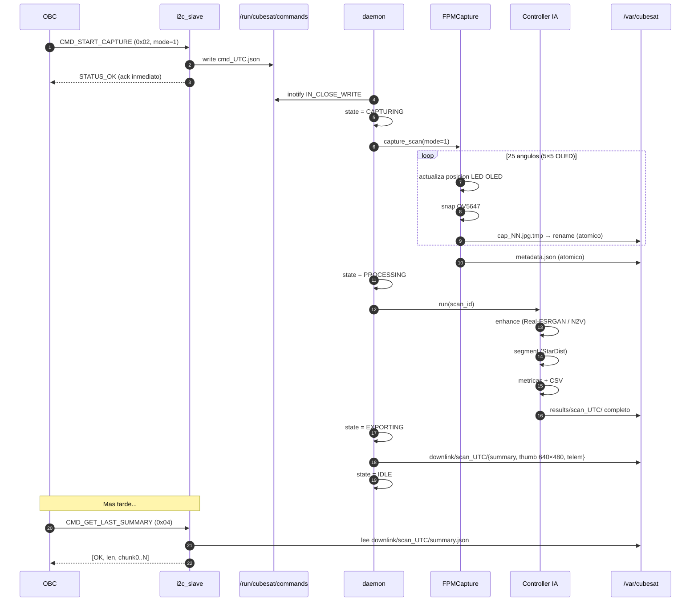
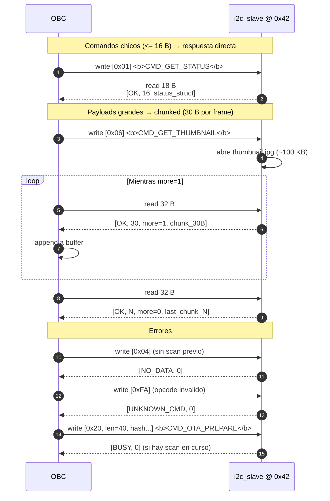
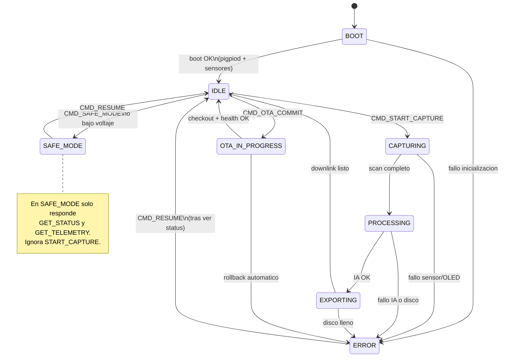
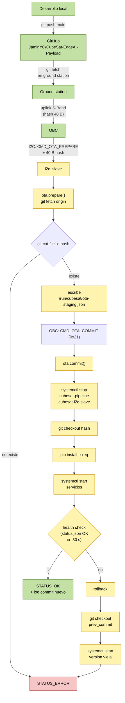

# CubeSat Payload — Arquitectura Detallada

Diagramas de bloques del payload de microscopia FPM integrado al bus INTISAT.
Los diagramas estan en [Mermaid](https://mermaid.js.org/): GitHub los renderiza
automaticamente y VS Code los muestra con la extension *Markdown Preview Mermaid Support*.

Indice:
1. [Integracion fisica (hardware)](#1-integracion-fisica-hardware)
2. [Stack de software en la RPi](#2-stack-de-software-en-la-rpi)
3. [Ciclo de vida de un scan](#3-ciclo-de-vida-de-un-scan)
4. [Protocolo I2C (chunking)](#4-protocolo-i2c-chunking)
5. [Maquina de estados](#5-maquina-de-estados)
6. [Flujo OTA](#6-flujo-ota)
7. [Mapeo de pines RPi5 - PC-104](#7-mapeo-de-pines-rpi5--pc-104)

---

## 1. Integracion fisica (hardware)

**Puntos clave**

- **Aislamiento electrico**: el TXS0108E evita que un glitch del bus del OBC llegue directo
  a la GPIO de la Pi (ambos lados operan a 3.3 V pero con tierras referenciadas distintas).
- **Proteccion termica**: el fusible PTC protege contra corto en la payload sin afectar al
  resto del bus — si la Pi consume > 5 A se resetea sola.
- **El CSI-2 NO pasa por PC-104**: la OV5647 se conecta directo a la Pi por cable FFC de 15 pines;
  PC-104 solo lleva alimentacion y comandos.

---

## 2. Stack de software en la RPi

**Separacion de responsabilidades**

| Servicio | Toca el bus I2C | Toca sensores | Toca IA | Reinicio si cuelga |
|---|:-:|:-:|:-:|:-:|
| `i2c-slave` | SI | NO | NO | `Restart=always` (3 s) |
| `pipeline` | NO | SI | SI | `WatchdogSec=600` |
| `telemetry` | NO | NO (solo sysfs) | NO | `Restart=always` |

---

## 3. Ciclo de vida de un scan

**Garantias**

- **Atomicidad**: todo archivo se escribe como `.tmp` y se renombra; si la Pi se cuelga
  a mitad de captura, el watcher nunca ve un `cap_NN.jpg` corrupto.
- **Ack inmediato**: el OBC no espera que termine el scan — le contestamos `OK` en < 10 ms
  y encolamos el trabajo. Luego consulta `GET_STATUS` para ver progreso.
- **Watchdog**: si `pipeline.daemon` se cuelga > 600 s sin hacer `sdnotify("WATCHDOG=1")`,
  systemd lo mata y reinicia — y el siguiente arranque re-procesa lo que quedo en `incoming/`.

---

## 4. Protocolo I2C (chunking)

**Limites del bus (I2C @ 100 kHz)**

- Comando chico (18 B): ~2 ms
- Thumbnail de 100 KB (3.3 k chunks × 2.8 ms): ~10 s
- `data.csv` de 1 MB: ~100 s — por eso es `on-demand`, no siempre en el downlink

---

## 5. Maquina de estados

---

## 6. Flujo OTA

**Invariantes del OTA**

- El hash siempre viene **pre-verificado** contra el repo remoto antes de apagar nada.
- Si el health check falla, la payload **vuelve sola** a la version anterior sin intervencion.
- `prev_commit` se guarda en `/var/cubesat/ota-rollback.json` antes del `checkout`.

---

## 7. Mapeo de pines RPi5 — PC-104

| Funcion | RPi 5 (BCM) | RPi 5 (Header) | PC-104 | Componente externo | Nota |
|---|---|---|---|---|---|
| 5V payload | — | pin 2/4 | H1.41-43 | EPS | pasa por LDO + fusible |
| GND potencia | — | pin 6/9/14/20/25 | H1.47-52 | EPS | 6 pines, bajo inrush |
| SDA I2C_2 | GPIO2 | pin 3 | H1.21 | OBC | via TXS0108E |
| SCL I2C_2 | GPIO3 | pin 5 | H1.23 | OBC | via TXS0108E |
| GND datos | — | pin 39 | H2.51-52 | OBC | referencia I2C |
| MOSI SPI0 | GPIO10 | pin 19 | — | OLED SSD1351 | directo |
| SCLK SPI0 | GPIO11 | pin 23 | — | OLED SSD1351 | directo |
| CE0 SPI0 | GPIO8 | pin 24 | — | OLED SSD1351 | directo |
| OLED DC | GPIO18 | pin 12 | — | OLED SSD1351 | data/command |
| OLED RST | GPIO24 | pin 18 | — | OLED SSD1351 | reset activo bajo |
| CSI-2 | — | conector FFC | — | OV5647 | cable plano 15 pines |

**Resumen de lo que NO usa el payload**

- I2C_1 del bus (ya saturado con sensores de sistema)
- UART/CAN (los libera para comms)
- SPI_2/3 del bus (solo usamos SPI0 local de la Pi para el OLED)

---

## Ver tambien

- [`README.md`](README.md) — vista general + instalacion + tabla de comandos
- [`../Documentos de Referencia/Plan_CubeSat_RPi.md`](../Documentos%20de%20Referencia/Plan_CubeSat_RPi.md) — plan de integracion completo
- [`../Documentos de Referencia/Pipeline_IA_Microscopía.pdf`](../Documentos%20de%20Referencia/) — fundamento tecnico del pipeline de IA
